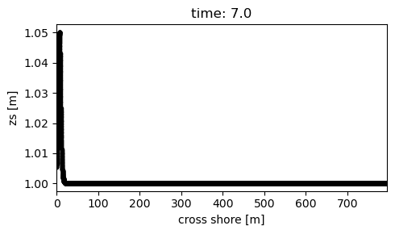

## Tests with analytical $\varepsilon$ = 0.1

CFL = 0.95
Using
* Model time           = 250
* num_analysis_times   = 100


Using
* Model time           = 250
* num_analysis_times   = 500


-----------------------------------------------------------------


* Made order = 2
Model Conditions
``` python
# For the time being including the wbctype here so that it can be added to the physical process location
xb_setup.set_params({"wbctype"      : "ts_nonh",
                     'wavemodel'    : 'nonh',
                     'CFL'          : 0.75,

                     'viscosity'    : 0, # Turned this off, didn't have much? impact on the 40 sec
                     'lwave'        : 0, # Adding this
                     'bedfriccoef'  : 0.0,
                     'morphology'   : 0,
                     "rugdepth"     : 0.010000,
                     'zs0'          : 1,
                     'order'        : 2,

                     'front'        : "nonh_1d", 'back'         : "abs_1d" ,
                     'left'         : "neumann", 'right'        : "neumann",

                     'tstop'        : model_time,
                     
                     "tintm"        : 0.1,
                     "tintp"        : 0.1,
                     "tintg"        : 0.1,
                     'nglobalvar'   : ['zs', 'zb', 'H'],
})
```


* Made lwave = 1
Model Conditions

``` python
# For the time being including the wbctype here so that it can be added to the physical process location
xb_setup.set_params({"wbctype"      : "ts_nonh",
                     'wavemodel'    : 'nonh',
                     'CFL'          : 0.75,

                     'viscosity'    : 0, # Turned this off, didn't have much? impact on the 40 sec
                     'lwave'        : 1, # Adding this
                     'bedfriccoef'  : 0.0,
                     'morphology'   : 0,
                     "rugdepth"     : 0.010000,
                     'zs0'          : 1,
                     'order'        : 1,

                     'front'        : "nonh_1d", 'back'         : "abs_1d" ,
                     'left'         : "neumann", 'right'        : "neumann",

                     'tstop'        : model_time,
                     
                     "tintm"        : 0.1,
                     "tintp"        : 0.1,
                     "tintg"        : 0.1,
                     'nglobalvar'   : ['zs', 'zb', 'H'],
})
```


* Made rugdepth = -1
``` python
# For the time being including the wbctype here so that it can be added to the physical process location
xb_setup.set_params({"wbctype"      : "ts_nonh",
                     'wavemodel'    : 'nonh',
                     'CFL'          : 0.5,

                     'viscosity'    : 0, # Turned this off, didn't have much? impact on the 40 sec
                     'lwave'        : 1, # Adding this
                     'bedfriccoef'  : 0.0,
                     'morphology'   : 0,
                     "rugdepth"     : -1,
                     'zs0'          : 1,
                     'order'        : 1,

                     'front'        : "nonh_1d", 'back'         : "abs_1d" ,
                     'left'         : "neumann", 'right'        : "neumann",

                     'tstop'        : model_time,
                     
                     "tintm"        : 0.1,
                     "tintp"        : 0.1,
                     "tintg"        : 0.1,
                     'nglobalvar'   : ['zs', 'zb', 'H'],
})
```


-------------------------------------------
Changed nhlayto 0.5

``` python
# For the time being including the wbctype here so that it can be added to the physical process location
xb_setup.set_params({"wbctype"      : "ts_nonh",
                     'wavemodel'    : 'nonh',
                     'CFL'          : 0.75,
                     'nonhq3d'      : 1,
                     'nhlay'        : 0.5, # Curent change
                     'viscosity'    : 0, 
                     'lwave'        : 1, 
                     'bedfriccoef'  : 0.0,
                     'morphology'   : 0,
                     'zs0'          : 1,
                     'order'        : 1,

                     'front'        : "nonh_1d", 'back'         : "abs_1d" ,
                     'left'         : "neumann", 'right'        : "neumann",

                     'tstop'        : model_time,
                     
                     "tintm"        : 0.1,
                     "tintp"        : 0.1,
                     "tintg"        : 0.1,
                     'nglobalvar'   : ['zs', 'zb', 'H'],
})
```


-------------------------------------------------
Set Arc = 0. ARC  = 1 is the default and controls the reflection of the boundary so it should be 1 just checking what it does.

``` python
# For the time being including the wbctype here so that it can be added to the physical process location
xb_setup.set_params({"wbctype"      : "ts_nonh",
                     'wavemodel'    : 'nonh',
                     'CFL'          : 0.75,
                     'nonhq3d'      : 1,
                     'nhlay'        : 0.5, 
                     'viscosity'    : 0, 
                     'lwave'        : 1, 
                     'bedfriccoef'  : 0.0,
                     'morphology'   : 0,
                     'zs0'          : 1,
                     'order'        : 1,
                     'ARC'          : 0, # Curent change - defaults to 1 and should be 1
                     'front'        : "nonh_1d", 'back'         : "abs_1d" ,
                     'left'         : "neumann", 'right'        : "neumann",

                     'tstop'        : model_time,
                     
                     "tintm"        : 0.1,
                     "tintp"        : 0.1,
                     "tintg"        : 0.1,
                     'nglobalvar'   : ['zs', 'zb', 'H'],
})
```

Makes the wave dissapear so that doens't look right


``` python
```

-----------------------------------------------
Checking if adding the average v-velocity is having and impact

``` python
# For the time being including the wbctype here so that it can be added to the physical process location
xb_setup.set_params({"wbctype"      : "ts_nonh",
                     'wavemodel'    : 'nonh',
                     'CFL'          : 0.75,
                     'nonhq3d'      : 1,
                     'nhlay'        : 0.5, 
                     'viscosity'    : 0, 
                     'lwave'        : 1, 
                     'bedfriccoef'  : 0.0,
                     'morphology'   : 0,
                     'zs0'          : 1,
                     'order'        : 1,
                     'ARC'          : 1, 
                     'front'        : "nonh_1d", 'back'         : "abs_1d" ,
                     'left'         : "neumann", 'right'        : "neumann",

                     'tstop'        : model_time,
                     
                     "tintm"        : 0.1,
                     "tintp"        : 0.1,
                     "tintg"        : 0.1,
                     'nglobalvar'   : ['zs', 'zb', 'H'],
})

```


--------------------------------------------------
Testing the CFL condition

### CFL = 0.5 - Doesn't seem to have an impact.
``` python
xb_setup.set_params({"wbctype"      : "ts_nonh",
                     'wavemodel'    : 'nonh',
                     'CFL'          : 0.5,
                     'nonhq3d'      : 1,
                     'nhlay'        : 0.5, 
                     'viscosity'    : 0, 
                     'lwave'        : 1, 
                     'bedfriccoef'  : 0.0,
                     'morphology'   : 0,
                     'zs0'          : 1,
                     'order'        : 1,
                     'ARC'          : 1, 
                     'front'        : "nonh_1d", 'back'         : "abs_1d" ,
                     'left'         : "neumann", 'right'        : "neumann",

                     'tstop'        : model_time,
                     
                     "tintm"        : 0.1,
                     "tintp"        : 0.1,
                     "tintg"        : 0.1,
                     'nglobalvar'   : ['zs', 'zb', 'H'],
})

```


### CFL = 0.3 - Doesn't seem to have an impact 
``` python
```

``` python
xb_setup.set_params({"wbctype"      : "ts_nonh",
                     'wavemodel'    : 'nonh',
                     'CFL'          : 0.3,
                     'nonhq3d'      : 1,
                     'nhlay'        : 0.5, 
                     'viscosity'    : 0, 
                     'lwave'        : 1, 
                     'bedfriccoef'  : 0.0,
                     'morphology'   : 0,
                     'zs0'          : 1,
                     'order'        : 1,
                     'ARC'          : 1, 
                     'front'        : "nonh_1d", 'back'         : "abs_1d" ,
                     'left'         : "neumann", 'right'        : "neumann",

                     'tstop'        : model_time,
                     
                     "tintm"        : 0.1,
                     "tintp"        : 0.1,
                     "tintg"        : 0.1,
                     'nglobalvar'   : ['zs', 'zb', 'H'],
})

```
**Note**: At this point I'm moving to plotting the actual intial time the wave enters the model

### CFL = 0.1 - No impact
``` python
xb_setup.set_params({"wbctype"      : "ts_nonh",
                     'wavemodel'    : 'nonh',
                     'CFL'          : 0.1,
                     'nonhq3d'      : 1,
                     'nhlay'        : 0.5, 
                     'viscosity'    : 0, 
                     'lwave'        : 1, 
                     'bedfriccoef'  : 0.0,
                     'morphology'   : 0,
                     'zs0'          : 1,
                     'order'        : 1,
                     'ARC'          : 1, 
                     'front'        : "nonh_1d", 'back'         : "abs_1d" ,
                     'left'         : "neumann", 'right'        : "neumann",

                     'tstop'        : model_time,
                     
                     "tintm"        : 0.1,
                     "tintp"        : 0.1,
                     "tintg"        : 0.1,
                     'nglobalvar'   : ['zs', 'zb', 'H'],
})

```


Included for referenc won't be included in the future report.


``` python
```
``` python
```
``` python
```
``` python
```
``` python
```
``` python
```
``` python
```
``` python
```
``` python
```
``` python
```


## Tests with analytical $\varepsilon$ = 0.01
